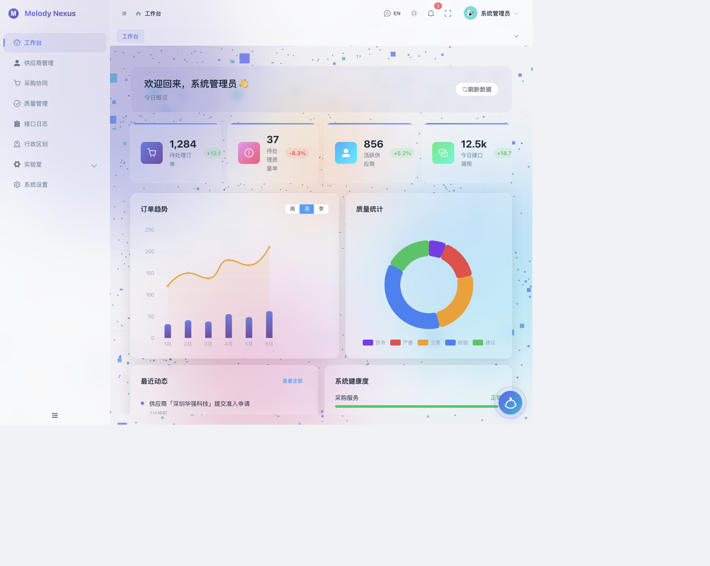

# Melody Nexus · 智能管理平台

<p align="center">
  
</p>

一个基于 Vue 3 的现代化智能管理平台，集成多维度仪表盘、权限管理、供应链管理、质量追溯等功能模块。

## 特性

- **Vue 3 + TypeScript** — Composition API + `<script setup>` 风格
- **Vite 6** — 极速开发体验
- **Element Plus** — 企业级 UI 组件库
- **国际化** — 内置中英文切换
- **动态权限** — 细粒度路由与按钮级权限控制
- **玻璃拟态设计** — 毛玻璃效果与流畅过渡动画
- **ECharts 可视化** — 仪表盘数据看板
- **AI 助手** — 集成智能对话组件

## 技术栈

| 类别     | 技术                             |
| -------- | -------------------------------- |
| 框架     | Vue 3 (Composition API)          |
| 构建     | Vite 6                           |
| 语言     | TypeScript                       |
| UI       | Element Plus, 自定义玻璃拟态主题 |
| 状态管理 | Pinia                            |
| 路由     | Vue Router                       |
| 国际化   | vue-i18n                         |
| 可视化   | ECharts                          |
| 工具库   | Lodash, QRCode 等                |

## 启动

```bash
# Node >= 18，推荐 20.x
nvm use 20.19.5

# 安装依赖
npm install

# 启动开发服务器
npm run dev
```

## 项目结构

```
src/
├── api/          # 接口层
├── components/   # 公共组件
├── layouts/      # 布局组件
├── router/       # 路由配置
├── stores/       # Pinia 状态
├── styles/       # 全局样式
├── utils/        # 工具函数
├── views/        # 页面视图
└── ...
```
